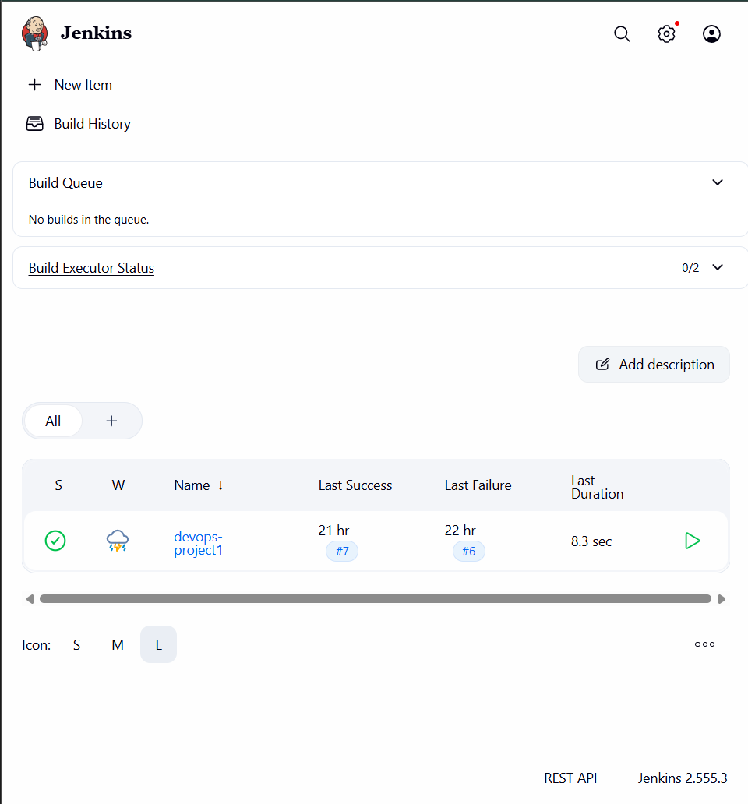
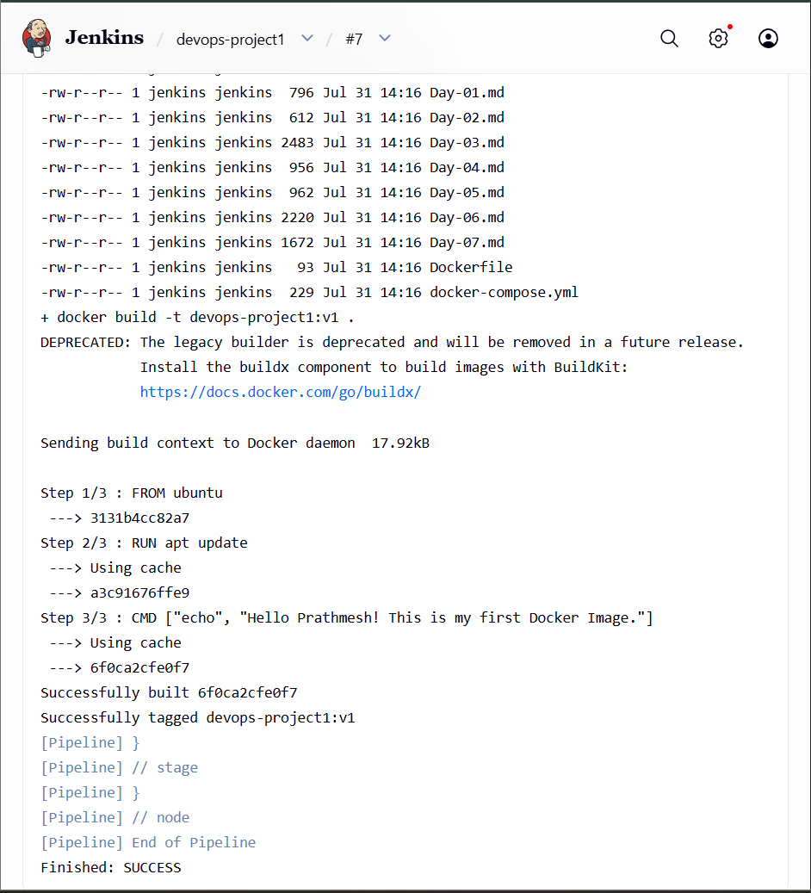
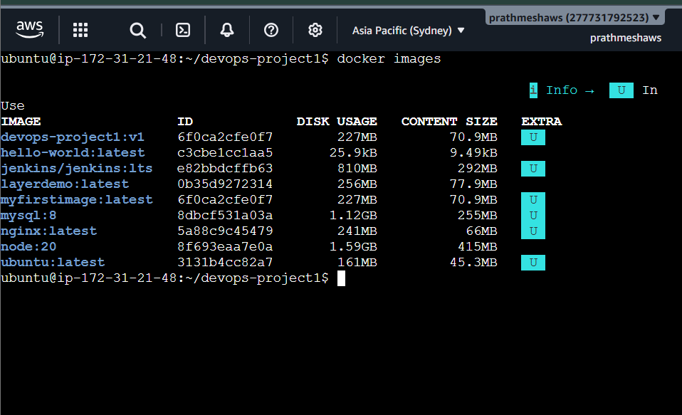

# DevOps Project 1 - Jenkins CI Pipeline


## 📌 Project Overview

This project demonstrates a Continuous Integration (CI) pipeline using Jenkins, Docker, GitHub, and AWS EC2.

The pipeline automatically:

- Clones the GitHub repository
- Checks Docker availability
- Builds a Docker image
- Reports build status

---
## 🏗️ Architecture

```text
                +--------------------+
                |     Developer      |
                +---------+----------+
                          |
                          | git push
                          v
                +--------------------+
                |      GitHub        |
                +---------+----------+
                          |
                          | Webhook / Poll SCM
                          v
                +--------------------+
                |      Jenkins       |
                +---------+----------+
                          |
                          | Build Pipeline
                          v
                +--------------------+
                |   Docker Build     |
                +---------+----------+
                          |
                          | Creates
                          v
                +--------------------+
                |   Docker Image     |
                +--------------------+
```
## 🛠️ Tech Stack

- AWS EC2
- Ubuntu Linux
- Git
- GitHub
- Docker
- Jenkins
- Node.js

---

## ⚙️ Jenkins Pipeline Stages

1. Clone Repository
2. Docker Version Check
3. Build Docker Image

---

## 🏗️ Architecture

```text
Developer
     │
     ▼
GitHub
     │
     ▼
Jenkins (AWS EC2)
     │
     ▼
Clone Repository
     │
     ▼
Docker Build
     │
     ▼
Docker Image
```

---

## 🚀 Result

- Successfully integrated Jenkins with GitHub
- Automated Docker image creation
- Learned CI Pipeline implementation
- Resolved Docker permission issues inside Jenkins

---

## 📚 Skills Learned

- Linux
- Git & GitHub
- Docker
- Jenkins
- AWS EC2
- CI Pipeline
---

# 📸 Project Screenshots

## Jenkins Dashboard



---

## Successful Jenkins Pipeline Build


---

## Docker Images


